## Citation

If you use this pipeline in your research, please cite:

```
https://github.com/gynecoloji/SnakeMake_ATACseq
```

**Please also cite the individual tools used:**
- **Snakemake**: Köster, J. and Rahmann, S. (2012). Snakemake—a scalable bioinformatics workflow engine. Bioinformatics, 28(19), 2520-2522.
- **MACS2**: Zhang, Y. et al. (2008). Model-based analysis of ChIP-Seq (MACS). Genome Biology, 9, R137.
- **deepTools**: Ramírez, F. et al. (2016). deepTools2: a next generation web server for deep-sequencing data analysis. Nucleic Acids Research, 44(W1), W160-W165.
- **HISAT2**: Kim, D. et al. (2019). Graph-based genome alignment and genotyping with HISAT2 and HISAT-genotype. Nature Biotechnology, 37, 907-915.
- **SAMtools**: Li, H. et al. (2009). The Sequence Alignment/Map format and SAMtools. Bioinformatics, 25(16), 2078-2079.
- **BEDTools**: Quinlan, A.R. and Hall, I.M. (2010). BEDTools: a flexible suite of utilities for comparing genomic features. Bioinformatics, 26(6), 841-842.
- **FastQC**: Andrews, S. (2010). FastQC: a quality control tool for high throughput sequence data.
- **fastp**: Chen, S. et al. (2018). fastp: an ultra-fast all-in-one FASTQ preprocessor. Bioinformatics, 34(17), i884-i890.

## License

This project is licensed under the MIT License - see the LICENSE file for details.

## Contact

**Author**: gynecoloji  
**Project Repository**: [https://github.com/gynecoloji/SnakeMake_ATACseq](https://github.com/gynecoloji/SnakeMake_ATACseq)

For questions, issues, or feature requests, please:
1. Check the existing [Issues](https://github.com/gynecoloji/SnakeMake_ATACseq/issues) on GitHub
2. Submit a new issue with detailed information about your problem
3. Include relevant log files and system information for troubleshooting

## Acknowledgments

This pipeline was developed based on best practices from the ENCODE consortium and incorporates methodologies from multiple published ATAC-seq analysis workflows. Special thanks to the developers of all the integrated tools that make this comprehensive analysis possible.

---

**Note**: This pipeline is optimized for human genome analysis (hg38) but can be adapted for other organisms by updating reference files and parameters accordingly. The hybrid approach using HISAT2 for ATAC-seq alignment provides robust results while maintaining compatibility with standard RNA-seq infrastructure.# ATAC-seq Analysis Pipeline

A comprehensive Snakemake workflow for processing and analyzing ATAC-seq data from raw reads to peak calling with extensive quality control metrics and differential binding analysis.

## Overview

This pipeline integrates three complementary components for complete ATAC-seq analysis:

1. **Primary ATAC-seq workflow** (`snakefile_ATACseq`) - Processes raw FASTQ files through alignment, filtering, and peak calling
2. **ATAC-seq QC workflow** (`snakefile_ATAC_QC`) - Generates extensive QC metrics and visualizations for quality assessment
3. **Differential Analysis Notebook** (`ATACseq_Dx.ipynb`) - Statistical analysis for identifying differential binding regions

## Workflow Diagram

The complete workflow is shown below:



## Features

- **Complete end-to-end processing** of paired-end ATAC-seq data
- **Extensive QC metrics** for comprehensive quality assessment
- **Blacklist region filtering** for removal of technical artifacts
- **Library complexity assessment** (NRF, PBC1, PBC2)
- **TSS enrichment analysis** for confirmation of open chromatin detection
- **Fragment size distribution** for nucleosomal pattern assessment
- **IDR analysis** for replicate consistency evaluation
- **Signal track generation** (bigWig, bedGraph) for visualization
- **Differential binding analysis** with multiple peak set strategies
- **Conda environment management** for simplified dependency handling
- **Hybrid alignment approach** using HISAT2 

## Pipeline Components

### 1. Primary Processing Pipeline (`snakefile_ATACseq`)

**Processing Steps:**
```
Raw FASTQ → FastQC → fastp → HISAT2 → SAM filtering → 
Duplicate removal → Blacklist filtering → Peak calling
```

**Key Features:**
- Quality assessment with FastQC
- Read trimming and filtering with fastp
- Alignment using HISAT2 with ATAC-seq optimized parameters
- Multi-step filtering: quality, duplicates, and blacklist regions
- Peak calling with MACS2 in paired-end mode

### 2. Quality Control Pipeline (`snakefile_ATAC_QC`)

**Comprehensive QC Metrics:**
- **Fragment Size Analysis** - Insert size distribution and nucleosomal patterns
- **Signal Quality** - Fingerprint plots for signal-to-noise assessment
- **Sample Correlation** - Multi-sample comparison and PCA analysis
- **GC Bias Assessment** - Sequence composition bias evaluation
- **TSS Enrichment** - Transcription start site signal enrichment
- **Mitochondrial Content** - Contamination assessment
- **FRiP Scores** - Fraction of Reads in Peaks quality metric
- **IDR Analysis** - Irreproducible Discovery Rate between replicates
- **Library Complexity** - PCR bottlenecking assessment (NRF, PBC1, PBC2)

### 3. Differential Binding Analysis (`ATACseq_Dx.ipynb`)

**Peak Set Generation Strategies:**
1. **Peak Union Method** - Overlapping regions from replicates with percentage thresholds
2. **Peak Merge Method** - Simple concatenation of all peaks
3. **Functional Regions** - Promoter and enhancer region analysis

**Statistical Framework:**
- Consensus peak set creation
- Read quantification using featureCounts
- Normalization and differential analysis preparation
- Support for DESeq2, edgeR, and limma workflows (Not included but you can continue with files generated by above steps)

## Requirements

The pipeline requires the following dependencies:

- [Snakemake](https://snakemake.readthedocs.io/) ≥7.0.0
- [Conda](https://docs.conda.io/en/latest/) / [Mamba](https://github.com/mamba-org/mamba) (recommended)
- [Python](https://www.python.org/) ≥3.8
- UNIX-based system (Linux/MacOS)

### Software Dependencies
(automatically installed via conda environments):
- **FastQC** (quality control)
- **fastp** (read trimming)
- **HISAT2** (alignment)
- **SAMtools** (BAM processing)
- **Picard** (duplicate removal)
- **MACS2** (peak calling)
- **deepTools** (QC and visualization)
- **bedtools** (genomic interval operations)
- **IDR** (reproducibility analysis)
- **featureCounts** (read quantification)

### Python Libraries
You can install packages needed for it via ATACSeq_Dx.yaml
For differential analysis notebook:
```python
import numpy as np
import pandas as pd
import pysam
import matplotlib.pyplot as plt
import seaborn as sns
import pybedtools
from collections import defaultdict
import itertools
import subprocess
import re
```

### Reference Files Required
```
ref/
├── config.yaml                    # Pipeline configuration
├── samples.csv                    # Sample metadata
├── hg38.2bit                     # Genome sequence
├── gencode.v36.annotation.gtf    # Gene annotations  
├── ENSEMBL/                 # HISAT2 genome index
├── hg38-blacklist.v2.bed         # ENCODE blacklist regions
├── promoter.bed                  # Promoter regions
├── enhancer.bed                  # Enhancer regions
└── picard.jar                    # Picard tools
```

## Installation

```bash
# Clone the repository
git clone https://github.com/gynecoloji/SnakeMake_ATACseq.git
cd SnakeMake_ATACseq

# Create main conda environment
conda env create -f environment.yaml
conda activate atacseq
```

## Configuration

Edit `ref/config.yaml` to match your experimental setup and reference files:

```yaml
# Sample information
samples_table: "samples.csv"  # CSV with sample_id and group columns

# Reference data
hisat2_index: "ref/ENSEMBL/genome"  # generated or downloaded by yourself
blacklist: "ref/hg38-blacklist.v2.bed"
gtf_file: "ref/gencode.v36.annotation.gtf"  # generated or downloaded by yourself
genome_2bit: "ref/hg38.2bit" # generated or downloaded by yourself
```

## Data Preparation

### Input Files

Place paired-end FASTQ files in the `data/` directory following this naming convention:
```
data/{sample}_R1_001.fastq.gz
data/{sample}_R2_001.fastq.gz
```

### Sample Information

Create `samples.csv`:
```csv
sample_id,group
GSF4007-Control_1_S11,Control
GSF4007-Control_2_S13,Control
GSF4007-Control_3_S15,Control
GSF4007-NICD3-V5_1_S12,Treatment
GSF4007-NICD3-V5_2_S14,Treatment
GSF4007-NICD3-V5_3_S16,Treatment
```

The `group` column is used for organizing samples into experimental groups for IDR analysis.

## Running the Pipeline

### Dry Run

To check the workflow without executing any commands:
```bash
# Check primary processing pipeline
snakemake -s snakefile_ATACseq -n

# Check QC pipeline
snakemake -s snakefile_ATAC_QC -n
```

### Local Execution

```bash
# Run primary processing pipeline
snakemake -s snakefile_ATACseq --use-conda --cores 20

# Run QC pipeline (after primary processing completes)
snakemake -s snakefile_ATAC_QC --use-conda --cores 20
```

### Differential Analysis
```bash
# Launch Jupyter notebook for differential analysis
jupyter notebook ATACseq_Dx.ipynb
```

### Cluster Execution

For execution on a SLURM cluster: (Not tested)
```bash
snakemake -s snakefile_ATACseq --use-conda \
  --cluster "sbatch -p {params.partition} -c {threads} -t {params.time}" \
  --jobs 100
```

## Pipeline Details

### 1. Quality Control and Preprocessing

- **FastQC** - Quality assessment of raw reads
- **Fastp** - Adapter trimming and quality filtering with the following parameters:
  - Minimum read length: 30bp
  - Auto-detection of adapters for paired-end data
  - Polyg tail trimming
  - Quality trimming: sliding window of 4 with mean quality 20

### 2. Alignment and Filtering

- **HISAT2** - Alignment to reference genome with ATAC-seq optimized options:
  - No spliced alignment (`--no-spliced-alignment`)
  - No discordant alignments (`--no-discordant`)
  - No mixed alignments (`--no-mixed`)
  - Insert size up to 3000bp (`-X 3000`)
- **SAMtools** - Multi-step filtering and processing:
  - Properly paired reads only (`-f 0x2`)
  - Primary alignments only (`-F 0x100`)
  - Uniquely mapped reads only (`NH:i:1`)

### 3. Post-processing

- **Picard MarkDuplicates** - PCR duplicate removal with `REMOVE_DUPLICATES=true`
- **Fragment-level blacklist filtering** - ENCODE blacklist region removal using bedtools with proper paired-end handling

### 4. Peak Calling

- **MACS2** - Peak calling with ATAC-seq optimized parameters:
  - Format: BAMPE (paired-end mode)
  - Genome size: hs (human)
  - No model (`--nomodel`)
  - Shift: -75
  - Extension size: 150bp
  - q-value cutoff: 0.05

### 5. Comprehensive QC Metrics

- **Fragment Size Analysis** - Nucleosomal pattern assessment using `bamPEFragmentSize`
- **TSS Enrichment** - Signal enrichment around transcription start sites
- **Fingerprint Analysis** - Signal enrichment assessment using `plotFingerprint`
- **GC Bias Assessment** - Sequence composition bias evaluation
- **Sample Correlation** - Multi-sample comparison with PCA analysis
- **Library Complexity Metrics**:
  - **NRF** (Non-redundant Fraction): Distinct locations / Total fragments
  - **PBC1** (PCR Bottlenecking Coefficient 1): N1/Nd
  - **PBC2** (PCR Bottlenecking Coefficient 2): N1/N2
- **FRiP Score** - Fraction of reads in peaks calculation
- **MT Content** - Mitochondrial contamination assessment
- **IDR Analysis** - Irreproducible Discovery Rate for replicate consistency

### 6. Differential Binding Analysis

**Multiple Peak Set Strategies:**
- **Peak Union Method**: Identifies overlapping regions between replicates with customizable overlap percentage (default: 50%)
- **Peak Merge Method**: Concatenates all individual peak files
- **Functional Region Analysis**: Uses predefined promoter and enhancer regions

**Quantification Approach:**
- Uses `featureCounts` with paired-end fragment counting
- Generates count matrices for statistical analysis
- Supports multiple region types (narrowPeak, broadPeak, functional regions)

## Output Files

The pipeline generates the following output directories:

```
results/
├── fastqc/                 # FastQC reports
├── fastp/                  # Trimmed reads and reports
├── aligned/                # HISAT2 alignment files
├── filtered/               # Filtered BAM files
├── dedup/                  # Deduplicated BAM files
├── blacklist_filtered/     # Blacklist-filtered BAM files
├── peaks/                  # MACS2 peak calls
├── bigwig/                 # BigWig files for visualization
├── bedgraph/               # Bedgraph files for visualization
├── deeptools/              # DeepTools analysis results
│   ├── fragmentSize.png    # Fragment size distribution
│   ├── fragmentsize.txt    # Fragment size data
│   ├── ATACseq_fingerprint.pdf # Fingerprint analysis
│   ├── ATACseq_fingerprint.tab # Fingerprint data
│   ├── Heatmap_TSS.pdf     # TSS enrichment heatmap
│   ├── Profile_TSS.pdf     # TSS enrichment profile
│   ├── matrix.mat.gz       # TSS enrichment matrix
│   ├── *_gc_content.pdf    # GC bias plots
│   ├── *_gc_content.txt    # GC bias data
│   ├── deeptools_heatmap.pdf # Sample correlation heatmap
│   ├── deeptools_scatterplot.pdf # Sample correlation scatter
│   ├── deeptools_PCA.pdf   # PCA plot
│   ├── deeptools_PCA.tab   # PCA data
│   ├── deeptools_multiBAM.out.npz # Multi-sample correlation data
│   ├── deeptools_readCounts.tab # Read count data
│   └── *.counts_chr.txt    # Chromosome read count files
├── FRiP/                   # Fraction of reads in peaks
│   └── *.frip.txt          # FRiP scores for each sample
├── library_complexity/     # Library complexity metrics
│   └── *_complexity.txt    # NRF, PBC1, PBC2 metrics
├── IDR/                    # IDR analysis results
│   └── *--idr_peaks.*.txt  # IDR peak calls between replicates
├── diff_region/            # Differential binding analysis
│   ├── PeakUnion_peaks.bed # Union peak set
│   ├── PeakMerge_peaks.bed # Merged peak set
│   ├── PeakUnion_counts.txt # Read counts in union peaks
│   ├── PeakMerge_counts.txt # Read counts in merged peaks
│   ├── promoter_chr1-22X.txt # Promoter region counts
│   ├── enhancer_chr1-22X.txt # Enhancer region counts
│   ├── Promoter_UCSC_hg38_3000bp_chr1-22X.txt # UCSC promoter counts (3kb)
│   └── Promoter_UCSC_hg38_5000bp_chr1-22X.txt # UCSC promoter counts (5kb)
└── qc/                     # QC summary reports
    └── blacklist_filtering_stats.txt # Blacklist filtering statistics
```

### Directory Structure
```
ATAC-seq-Pipeline/
├── data/                   # Raw FASTQ files
├── ref/                    # Reference files and configuration
│   └── hisat2_index/       # HISAT2 genome index
├── envs/                   # Conda environment files
├── results/                # All pipeline outputs (detailed above)
├── analysis/               # Analysis workspace
│   └── diff_region/        # Differential analysis working directory
├── logs/                   # Comprehensive logging system
│   ├── fastqc/, fastp/, hisat2/, samtools/, dedup/
│   ├── blacklist_filter/, macs2/, deeptools_*/
│   ├── FRIP/, idr/, library_complexity/
│   └── blacklist_stats/
└── temp/                   # Temporary processing files
```

## Troubleshooting

### Common Issues

1. **Low alignment rate** 
   - Check reference genome compatibility and version
   - Verify adapter trimming parameters in fastp step
   - Check for sample contamination or incorrect library prep
   - Examine FastQC reports for quality issues

2. **High duplication rate**
   - Indicates low library complexity issue
   - Consider optimizing chromatin extraction or Tn5 tagmentation conditions
   - May require increased sequencing depth for better coverage
   - Check PBC1 and PBC2 metrics for severity assessment

3. **Poor TSS enrichment**
   - Issues with sample quality or chromatin accessibility
   - Check protocol for nuclei isolation and tagmentation efficiency
   - Verify blacklist filtering is not removing genuine signal
   - Consider cell type-specific accessibility patterns

4. **High mitochondrial content**
   - Common in certain cell types but may indicate technical issues
   - Consider optimizing nuclear isolation protocols
   - May require additional sequencing depth to compensate for lost reads
   - Check for cytoplasmic contamination during sample prep

5. **Failed IDR analysis**
   - Low reproducibility between biological replicates
   - Check experimental conditions for consistency across replicates
   - May indicate technical issues with sample preparation or processing
   - Consider peak calling parameters if IDR consistently fails

6. **Fragment size distribution issues**
   - Should show nucleosomal ladder pattern (147bp, 294bp, etc.)
   - Flat distribution may indicate DNA degradation or poor tagmentation
   - Very short fragments may indicate over-tagmentation

### Performance Optimization
- Adjust thread counts based on available resources
- Use SSD storage for temporary files when possible
- Monitor memory usage during peak calling with large datasets
- Consider using `--cluster` mode for large-scale analyses

### Log Files

Comprehensive log files for each step are stored in the `logs/` directory:
```
logs/
├── fastqc/                         # FastQC execution logs
├── fastp/                          # Read trimming logs
├── hisat2/                         # Alignment logs
├── samtools/                       # BAM processing logs
├── dedup/                          # Duplicate removal logs
├── blacklist_filter/               # Blacklist filtering logs
├── macs2/                          # Peak calling logs
├── deeptools_bedgraph/             # Bedgraph generation logs
├── deeptools_bigwig/               # BigWig generation logs
├── deeptools_fragmentsize/         # Fragment size analysis logs
├── deeptools_plotfingerprint/      # Fingerprint analysis logs
├── deeptools_correlation/          # Correlation analysis logs
├── deeptools_gc_bias/              # GC bias analysis logs
├── mt_content/                     # Mitochondrial content logs
├── deeptools_tss/                  # TSS enrichment logs
├── FRIP/                           # FRiP calculation logs
├── idr/                            # IDR analysis logs
├── library_complexity/             # Library complexity logs
└── blacklist_stats/                # Blacklist filtering statistics logs
```

## Citation

If you use this pipeline, please cite the relevant tools:
- Snakemake: Köster & Rahmann (2012)
- MACS2: Zhang et al. (2008) 
- deepTools: Ramírez et al. (2016)
- HISAT2: Kim et al. (2019)

## Contact

For questions or issues with this pipeline, please refer to the individual tool documentation or submit an issue to the repository.

---

**Note**: This pipeline is optimized for human genome analysis (hg38) but can be adapted for other organisms by updating reference files and parameters.