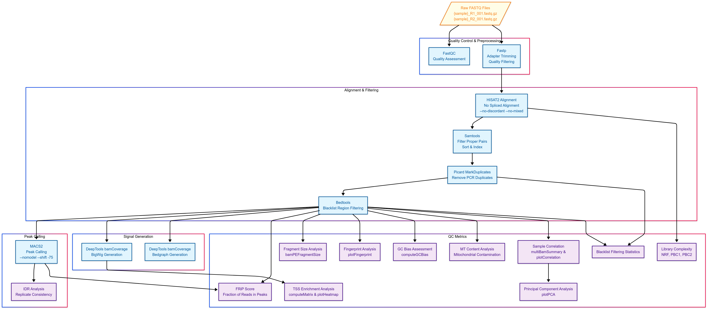

# ATAC-seq Analysis Pipeline

A comprehensive Snakemake workflow for processing and analyzing ATAC-seq data from raw reads to peak calling with extensive quality control metrics.

## Overview

This pipeline integrates two complementary Snakemake workflows:
1. **Primary ATAC-seq workflow** - Processes raw FASTQ files through alignment, filtering, and peak calling
2. **ATAC-seq QC workflow** - Generates extensive QC metrics and visualizations for quality assessment

## Workflow Diagram

The complete workflow is shown below:



## Features

- **Complete end-to-end processing** of paired-end ATAC-seq data
- **Extensive QC metrics** for comprehensive quality assessment
- **Blacklist region filtering** for removal of technical artifacts
- **Library complexity assessment** (NRF, PBC1, PBC2)
- **TSS enrichment analysis** for confirmation of open chromatin detection
- **Fragment size distribution** for nucleosomal pattern assessment
- **IDR analysis** for replicate consistency evaluation
- **Signal track generation** (bigWig, bedGraph) for visualization
- **Conda environment management** for simplified dependency handling

## Requirements

The pipeline requires the following dependencies:

- [Snakemake](https://snakemake.readthedocs.io/) ≥7.0.0
- [Conda](https://docs.conda.io/en/latest/) / [Mamba](https://github.com/mamba-org/mamba) (recommended)
- [Python](https://www.python.org/) ≥3.8
- UNIX-based system (Linux/MacOS)

Software dependencies (automatically installed via conda environments):
- FastQC
- Fastp
- HISAT2
- Samtools
- Picard
- BEDTools
- MACS2
- DeepTools
- IDR

## Installation

```bash
# Clone the repository
git clone https://github.com/yourusername/atac-seq-pipeline.git
cd atac-seq-pipeline

# Create main conda environment
conda env create -f environment.yaml
conda activate atac_seq
```

## Configuration

Edit `ref/config.yaml` to match your experimental setup and reference files:

```yaml
# Sample information
samples_table: "samples.csv"  # CSV with sample_id and group columns

# Reference data
hisat2_index: "path/to/hisat2_index" 
blacklist: "path/to/blacklist.bed"
gtf_file: "path/to/gencode.v36.annotation.gtf"
genome_2bit: "path/to/hg38.2bit"
```

## Data Preparation

### Input Files

Place paired-end FASTQ files in the `data/` directory following this naming convention:
```
data/{sample}_R1_001.fastq.gz
data/{sample}_R2_001.fastq.gz
```

### Sample Information

Create a samples table CSV file with the following format:
```csv
sample_id,group
sample1,control
sample2,control
sample3,treatment
sample4,treatment
```

The `group` column is used for organizing samples into experimental groups for IDR analysis.

## Running the Pipeline

### Dry Run

To check the workflow without executing any commands:
```bash
snakemake -n
```

### Local Execution

To run on a local machine with 8 cores:
```bash
snakemake --use-conda --cores 24
```

### Cluster Execution

For execution on a SLURM cluster: (Not tested)
```bash
snakemake --use-conda \
  --cluster "sbatch -p {params.partition} -c {threads} -t {params.time}" \
  --jobs 100
```

## Pipeline Details

### 1. Quality Control and Preprocessing

- **FastQC** - Quality assessment of raw reads
- **Fastp** - Adapter trimming and quality filtering with the following parameters:
  - Minimum read length: 30bp
  - Auto-detection of adapters for paired-end data
  - Polyg tail trimming
  - Quality trimming: sliding window of 4 with mean quality 20

### 2. Alignment and Filtering

- **HISAT2** - Alignment to reference genome with options:
  - No spliced alignment (--no-spliced-alignment)
  - No discordant alignments (--no-discordant)
  - No mixed alignments (--no-mixed)
  - Insert size up to 3000bp (-X 3000)
- **Samtools** - Filtering and processing of alignments:
  - Properly paired reads only (-f 0x2)
  - Primary alignments only (-F 0x100)
  - Uniquely mapped reads only (NH:i:1)

### 3. Post-processing

- **Picard MarkDuplicates** - PCR duplicate removal
- **BEDTools** - Filtering against blacklist regions

### 4. Peak Calling

- **MACS2** - Peak calling with the following parameters:
  - Format: BAMPE (paired-end)
  - Genome size: hs (human)
  - No model (--nomodel)
  - Shift: -75
  - Extension size: 150bp
  - q-value cutoff: 0.05

### 5. QC Metrics

- **Fragment Size Analysis** - Distribution visualization using DeepTools bamPEFragmentSize
- **TSS Enrichment** - Signal enrichment around transcription start sites
- **Fingerprint Analysis** - Assessment of signal enrichment using plotFingerprint
- **GC Bias Assessment** - GC content bias evaluation using computeGCBias
- **PCA/Correlation Analysis** - Sample correlation and principal component analysis
- **Library Complexity** - PCR bottleneck coefficients and non-redundant fraction
- **FRiP Score** - Fraction of reads in peaks calculation
- **MT Content** - Mitochondrial contamination assessment
- **IDR Analysis** - Irreproducible Discovery Rate for replicate consistency
- **Blacklist Filtering Statistics** - Evaluation of reads removed by blacklist filtering

## Output Files

The pipeline generates the following output directories:

```
results/
├── fastqc/                 # FastQC reports
├── fastp/                  # Trimmed reads and reports
├── aligned/                # HISAT2 alignment files
├── filtered/               # Filtered BAM files
├── dedup/                  # Deduplicated BAM files
├── blacklist_filtered/     # Blacklist-filtered BAM files
├── peaks/                  # MACS2 peak calls
├── bigwig/                 # BigWig files for visualization
├── bedgraph/               # Bedgraph files for visualization
├── deeptools/              # DeepTools analysis results
│   ├── fragmentSize.png    # Fragment size distribution
│   ├── ATACseq_fingerprint.pdf # Fingerprint analysis
│   ├── Heatmap_TSS.pdf     # TSS enrichment heatmap
│   ├── Profile_TSS.pdf     # TSS enrichment profile
│   ├── *_gc_content.pdf    # GC bias plots
│   ├── deeptools_heatmap.pdf # Sample correlation heatmap
│   ├── deeptools_PCA.pdf   # PCA plot
│   └── *.counts_chr.txt    # Chromosome read count files
├── FRiP/                   # Fraction of reads in peaks
├── library_complexity/     # Library complexity metrics
├── idr/                    # IDR analysis results
└── qc/                     # QC summary reports
```

## Quality Control Criteria

The following thresholds can be used to evaluate your ATAC-seq data quality:

| Metric | Description | Good | Acceptable | Poor |
|--------|-------------|------|------------|------|
| TSS Enrichment | Signal enrichment at transcription start sites | >10 | 5-10 | <5 |
| FRiP | Fraction of reads in peaks | >0.3 | 0.2-0.3 | <0.2 |
| NRF | Non-redundant fraction | >0.9 | 0.8-0.9 | <0.8 |
| PBC1 | PCR bottleneck coefficient 1 | >0.9 | 0.7-0.9 | <0.7 |
| PBC2 | PCR bottleneck coefficient 2 | >3 | 1-3 | <1 |
| MT Content | Mitochondrial read % | <20% | 20-30% | >30% |
| Fragment Size | Nucleosomal pattern | Clear pattern | Weak pattern | No pattern |
| IDR | Irreproducible Discovery Rate | >80% | 70-80% | <70% |

## Troubleshooting

### Common Issues

1. **Low alignment rate** 
   - Check reference genome compatibility
   - Verify adapter trimming parameters
   - Check for sample contamination

2. **High duplication rate**
   - Low library complexity issue
   - Consider optimizing chromatin extraction or Tn5 tagmentation
   - Increase sequencing depth for better coverage

3. **Poor TSS enrichment**
   - Issues with sample quality or chromatin accessibility
   - Check protocol for nuclei isolation and tagmentation
   - Verify blacklist filtering is not removing genuine signal

4. **High mitochondrial content**
   - Common in certain cell types
   - Consider nuclear isolation protocols
   - May require additional sequencing depth to compensate

5. **Failed IDR analysis**
   - Low reproducibility between replicates
   - Check experimental conditions for consistency
   - May indicate technical issues with sample preparation

### Log Files

Log files for each step are stored in the `logs/` directory:
```
logs/
├── fastqc/
├── fastp/
├── hisat2/
├── samtools/
├── dedup/
├── blacklist_filter/
├── macs2/
├── deeptools_bedgraph/
├── deeptools_bigwig/
├── deeptools_fragmentsize/
├── deeptools_plotfingerprint/
├── deeptools_correlation/
├── deeptools_gc_bias/
├── mt_content/
├── deeptools_tss/
├── FRIP/
├── idr/
└── blacklist_stats/
```

## Citation

If you use this pipeline in your research, please cite:

```
https://github.com/gynecoloji/SnakeMake_ATACseq
```

## License

This project is licensed under the MIT License - see the LICENSE file for details.

## Contact

Your Name - gynecoloji  
Project Link: [https://github.com/yourusername/atac-seq-pipeline](https://github.com/yourusername/atac-seq-pipeline)
